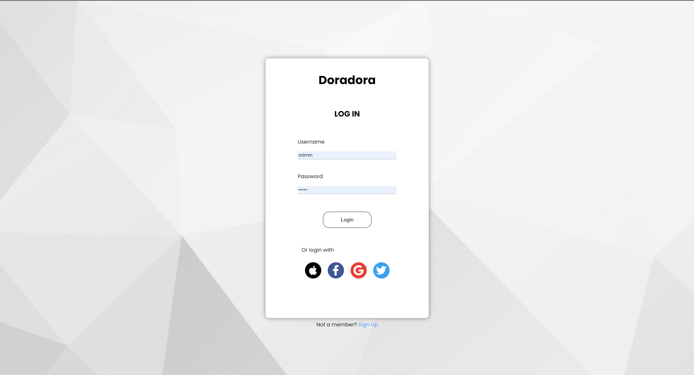
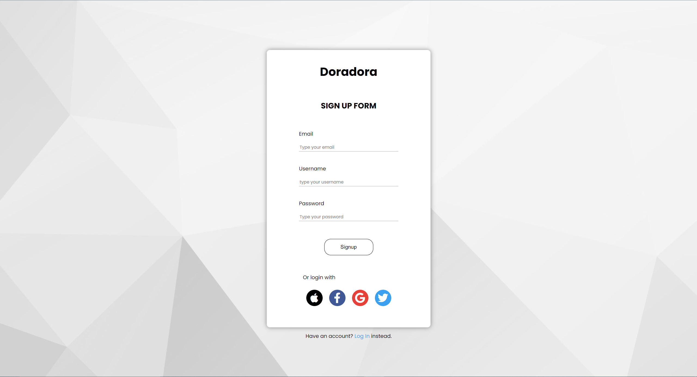
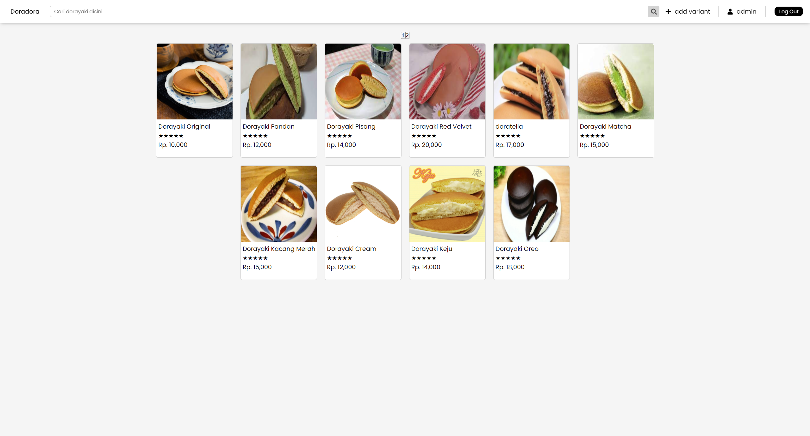
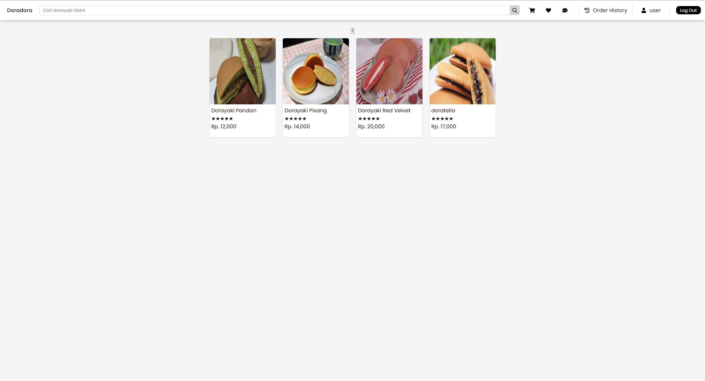
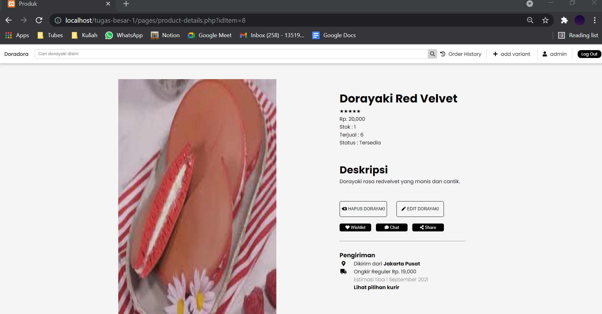
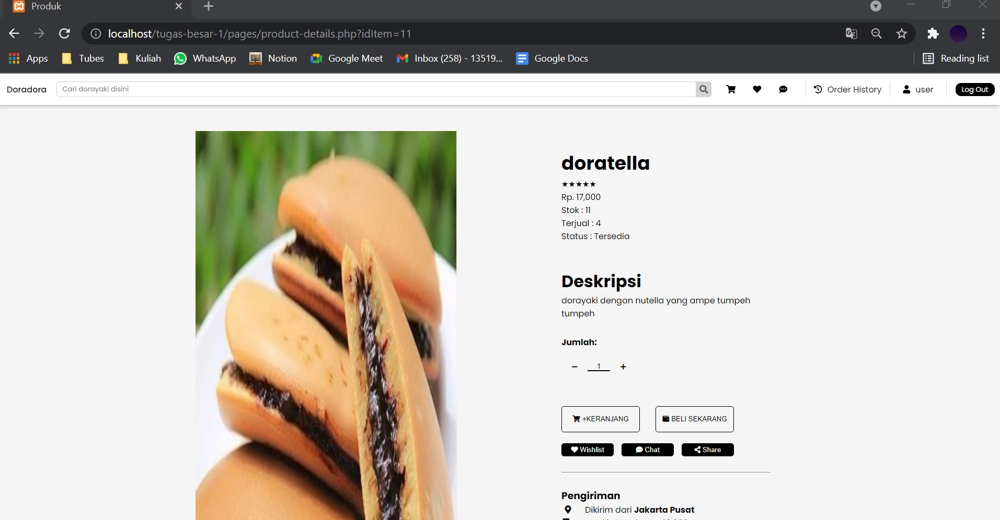
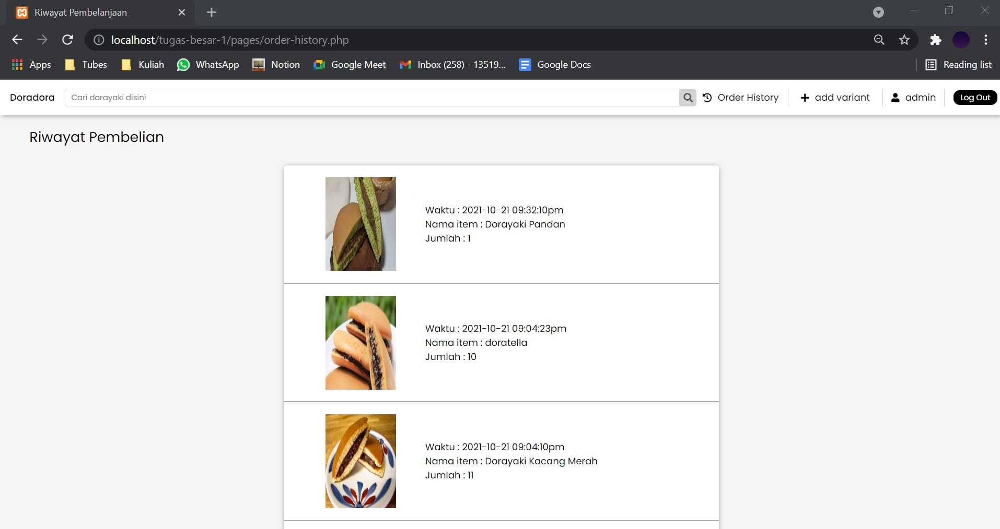
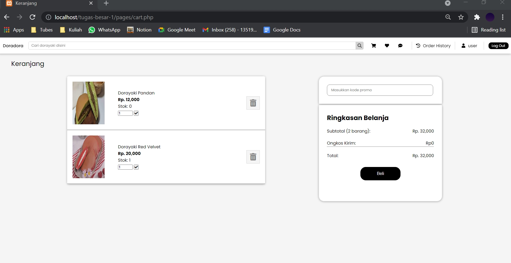
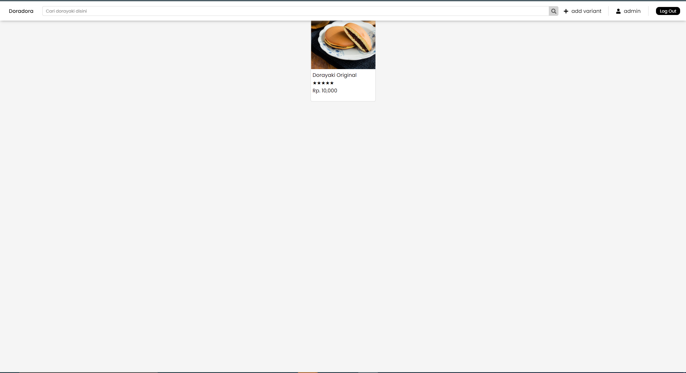
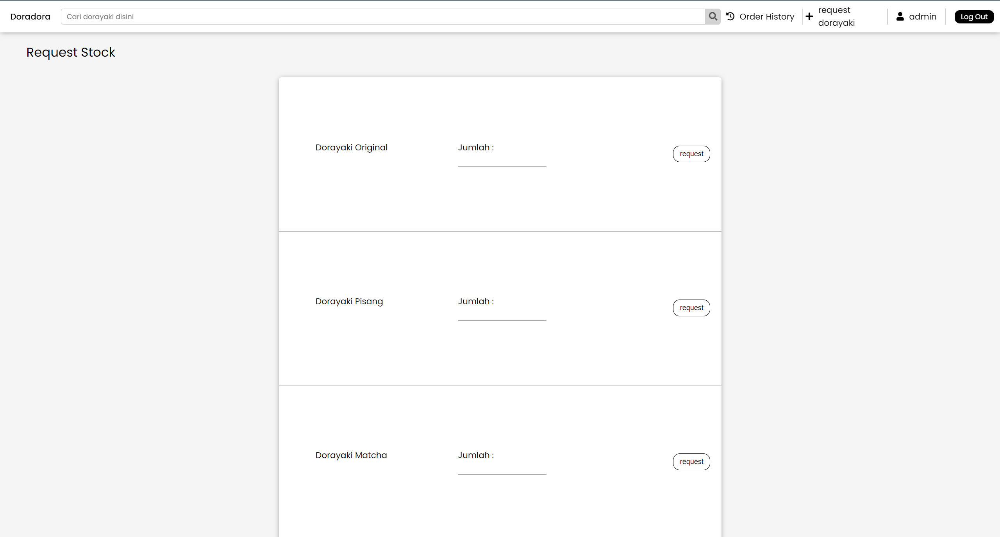

# Doradora
Doradora merupakan sebuah web e-commerce yang bergerak dalam penjualan berbagai varian dorayaki terbesar se pulau jawa. Dengan Doradora, pecinta dorayaki dapat mencari dan membeli berbagai varian dorayaki dari mulai pisang, oreo, nutella, dan masih banyak lagi.

## Table of contents
* [Daftar requirement](#Daftar-requirement)
* [Cara instalasi](#Cara-instalasi)
* [Cara menjalankan server](#Cara-menjalankan-server)
* [Screenshot tampilan](#Screenshot-tampilan)
* [Pembagian tugas](#Pembagian-tugas)


## Daftar requirement
1. Python 3
2. PHP
3. DB Browser
4. SQlite

## Cara instalasi
1. Install Python 3
2. Install PHP
3. Install SQlite
4. Install DB Browser
5. Pastikan Sqlite3 sudah diaktifkan pada php.ini. Caranya buka php.ini, lalu hapus ";" pada extension=sqlite3 
6. Pastikan socket sudah diaktifkan pada php.ini. Caranya buka php.ini, lalu hapus ";" pada extension=socket
6. Pastikan soap sudah diaktifkan pada php.ini. Caranya buka php.ini, lalu hapus ";" pada extension=soap
7. Lakukan clone dari repository program dengan git clone
8. Jalankan server

## Cara menjalankan server
1. Buka terminal.
2. Arahkan terminal ke directory program berada.
3. Jalankan perintah untuk menjalankan program pada local host dengan format "php -S localhost:xxxx".
```
php -S localhost:5000
```
4. Setelah localhost berhasil dijalankan, jalankan localhost pada browser.
```
localhost:5000
```
## Screenshot tampilan
1. Login

2. Sign up

3. Home page
homepage not signed

homepage admin

homepage user

3. Product details
product detail admin

product detail user

4. Order history

5. shoping cart

6. pencarian

7. Request



## perubahan
1. Tidak ada add variant
2. Update stock dilakukan melalui request

## Pembagian tugas 
Server-side
Login:13519027,13519071,13519161
Register: 13519027,13519071,13519161
Dashboard/Homepage: 13519027,13519071
Hasil pencarian : 13519027,13519071
Tambah variant baru : 13519161
Product Detail : 13519027,13519071, 13519161
pengubahan stock dan pembelian dorayaki: 13519027,13519071, 13519161


Client-side
Login : 13519027,13519071,13519161
Register : 13519027,13519071,13519161
Dashboard/Homepage : 13519027,13519071
Hasil pencarian : 13519027,13519071
Tambah variant baru : 13519161
Product Detail : 13519027,13519071
pengubahan stock dan pembelian dorayaki: 13519027,13519071
